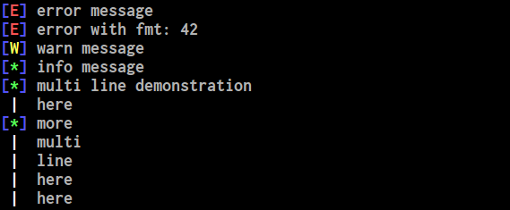

# Simple colored logger for rust #

The `colog` library is a simple formatter backend for the standard
rust logging system (in the `log` crate).

## Getting started ##

```rust
#[macro_use]
extern crate log;
extern crate colog;

fn main()
{
    colog::init();
    error!("error message");
    error!("error with fmt: {}", 42);
    warn!("warn message");
    info!("info message");
    debug!("debug message");
    trace!("trace message");

    info!("multi line demonstration\nhere");
    info!("more\nmulti\nline\nhere\nhere");
}
```

This results in the following terminal output:



## Known issues and improvements ##

The color and terminal handling could use a serious improvement, via
one of the nice terminal crates available now.

Patches welcome :)

## License ##

This project is licensed under the LGPLv3. See the file [LICENSE](LICENSE) for
details.
